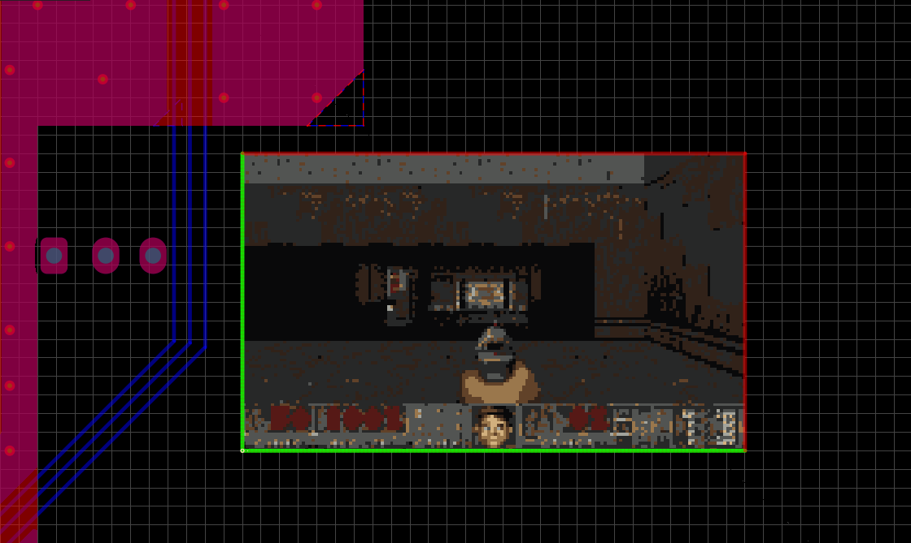

<h1 align="center">Doomium</h1>

<p align="center">DOOM in Altium Designer. The PCB can wait.</p>

<p align="center">
  
</p>

<p align="center">
  <a href="https://github.com/ikozlyanskiy/Doomium/releases/latest">Download</a> ·
  <a href="#controls">Controls</a> ·
  <a href="#building">Build from source</a>
</p>

Doomium runs DOOM inside a frame on your board. Move the frame and the game follows it; delete the frame and the game closes. Pick a renderer: a crisp window, PCB fill primitives, or colored PCB regions.

This version is for **Altium Designer 25 on Windows x64**. You'll also need a game WAD: [Freedoom](https://freedoom.github.io/) works, or you can use an IWAD from your own copy of DOOM. Game data isn't included in the download.

## Install

1. Download [Doomium-v0.3.0-ad25-win-x64.zip](https://github.com/ikozlyanskiy/Doomium/releases/download/v0.3.0/Doomium-v0.3.0-ad25-win-x64.zip) and extract it.
2. Save your documents and close Altium.
3. Open PowerShell in the extracted folder and run:

   ```powershell
   powershell -ExecutionPolicy Bypass -File .\Install-Doomium.ps1 -Prebuilt
   ```

4. Start Altium again. You can choose your WAD when the game starts, or put it beside the installed `Doomium.dll` beforehand. The installer prints that folder's path.

The installer handles registration and keeps a backup when updating an existing install. Altium supplies the .NET runtime; you only need the SDK if you want to build from source.

<details>
<summary>If Altium is installed somewhere else</summary>

The default program folder is `C:\Program Files\Altium\AD25`. Pass `-AltiumInstallDir` to use a different one.

The data folder is detected automatically if there is only one. If you have several Altium installations, pass `-AltiumDataRoot 'C:\ProgramData\Altium\Altium Designer {…}'` with the folder for your AD25 installation.

Add `-ValidateOnly` to check the paths and menu resources before installing.

</details>

## Make a frame

Open a `.PcbDoc`, draw four connected tracks forming a rectangle, and select all four. Then choose one of the three **Tools → Convert → Doomium** commands.

There's a catch with Altium's **Place → Rectangle** tool: its grouped rectangle doesn't reliably expose its tracks to the plugin. Use **Tools → Convert → Explode Rectangle to Free Primitives** first, select the four tracks, and try again. A single rectangular fill works too. Keep the frame aligned with the board axes.

**Doomium Original** draws the game in a window over the PCB. **Doomium Primitives** draws it with PCB fills; **Doomium Regions** uses colored PCB regions. The latter two change the board in memory while running. Try them on a spare `.PcbDoc` first and don't save during playback. [How the renderers work](docs/renderers.md).

Click the game to focus it. Middle-click over it to capture the mouse, then middle-click again when you want your Altium pointer back. You can grab the exposed frame border to move it around.

## Controls

| Action | Control |
| :-- | :-- |
| Forward / back | `W` / `S` or `↑` / `↓` |
| Strafe | `A` / `D` |
| Turn | Mouse while captured, `Q` / `E`, or `←` / `→` |
| Run | Hold `Shift` |
| Fire | Left mouse button or `Ctrl` |
| Use / open doors | Right mouse button or `Space` |
| Change weapon | `1`–`7` |
| Automap | `Tab` |
| Capture / release mouse | Middle mouse button over the game |
| Show these controls | `F1` in Original mode |
| Stop | `Esc`, or run the active Doomium command again |

## A few details

Original mode draws a 320×200 image scaled to the frame, with an FPS counter and an `F1` help overlay. Its pixels aren't saved in the `.PcbDoc` or included in fabrication output. Native modes use mechanical layers and leave the original frame in place; they restore temporary objects, colors, names, and visibility when playback stops normally. Their FPS depends heavily on board complexity and scene detail. On the test machine, complex scenes in Regions ran in single-digit FPS. `%LOCALAPPDATA%\Doomium\doomium.log` records native frame rates.

## Building

You'll need AD25 installed locally and a .NET SDK that can target `net6.0-windows`. The engine source is already in this repository.

```powershell
dotnet build .\Doomium\Doomium\Doomium.csproj -c Release
```

To build and install in one go, close Altium and run `.\Doomium\Doomium\Install-Doomium.ps1`. To make a release ZIP, run `.\Build-Release.ps1`; the archive and its SHA-256 checksum go into `dist/`.

The build references SDK assemblies from your Altium installation. Those DLLs aren't included in the release.

## Credits and license

The engine is [Managed Doom](https://github.com/sinshu/managed-doom), a C# port of DOOM by Nobuaki Tanaka. Doomium and the included engine source are licensed under **GPL v2 or later**. See [LICENSE](LICENSE) and [third-party notices](THIRD_PARTY_NOTICES.md) for the upstream revision and copyright details.

<details>
<summary>Кратко по-русски</summary>

DOOM прямо в Altium. Разводку платы можно ненадолго отложить.

Скачайте [ZIP из релиза](https://github.com/ikozlyanskiy/Doomium/releases/latest), распакуйте его и закройте Altium. В папке с файлами запустите `powershell -ExecutionPolicy Bypass -File .\Install-Doomium.ps1 -Prebuilt`. WAD выберите при первом запуске игры; подойдёт, например, Freedoom 2.

Рамка пока должна состоять из четырёх дорожек. Если нарисовали её через **Place → Rectangle**, сначала выполните **Tools → Convert → Explode Rectangle to Free Primitives**. Выделите все четыре дорожки и выберите **Tools → Convert → Doomium Original**, **Doomium Primitives** или **Doomium Regions**. Подойдёт и один прямоугольный Fill.

Средняя кнопка мыши включает и выключает захват. `WASD` — движение, ЛКМ — выстрел, ПКМ — открыть дверь или нажать кнопку, `Shift` — бег. В режиме Original подсказка открывается по `F1`. Выйти из игры — `Esc`. Режимы Primitives и Regions временно меняют открытую плату, поэтому сначала попробуйте их на отдельном `.PcbDoc` и не сохраняйте документ во время игры.

</details>
